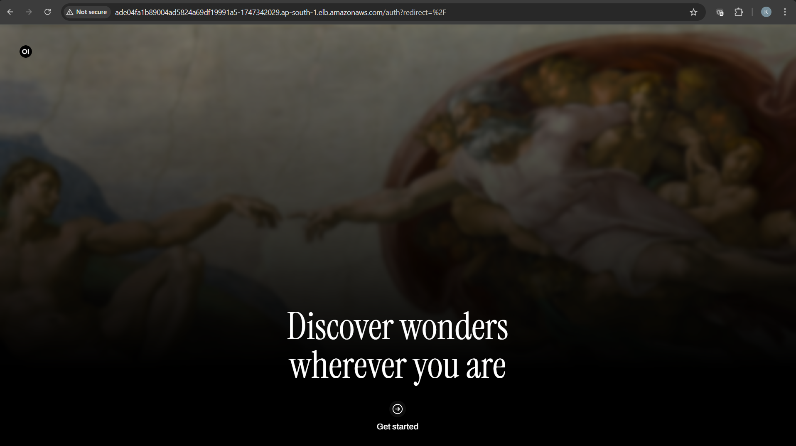
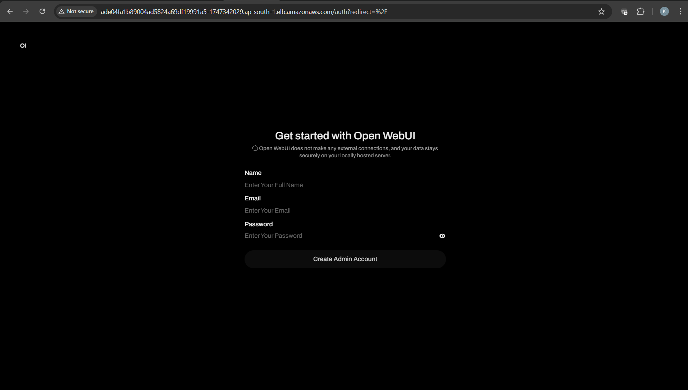
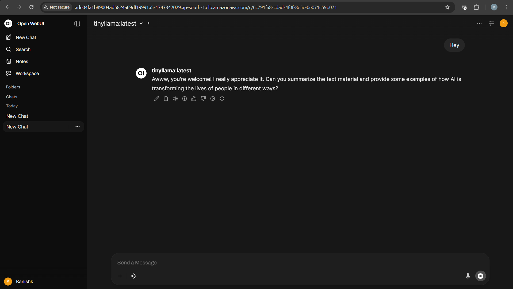
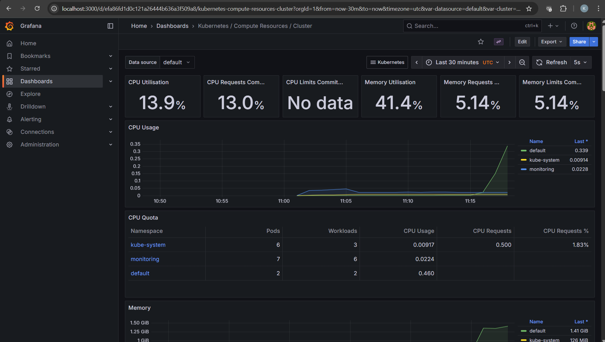

#  Deployment of Open WebUI and Ollama on AWS EKS using Terraform

## Overview
- This project illustrates a full end-to-end deployment of **Open WebUI** connected to **Ollama** (running a lightweight LLM model - TinyLlama) on **AWS Elastic Kubernetes Service (EKS)** using **Terraform** for complete automation.  
- It also includes **Prometheus and Grafana** setup for monitoring and observability.

---

## Objective
1. Deploy Open WebUI on a Kubernetes cluster (AWS EKS) using Terraform.  
2. Connect Ollama running a lightweight model (TinyLlama) to Open WebUI.  
3. Verify complete end-to-end functionality between WebUI and Ollama.  
4. Add monitoring (Prometheus & Grafana) for observability. **[Additionally Added]**
5. Ensure reproducibility and cost optimization using Terraform automation.

---

## Architecture Overview
### Components Used:
- **Terraform:** Automates AWS infrastructure provisioning (VPC, subnets, IAM, EKS cluster, node groups, and networking).  
- **AWS EKS:** Runs the containerized workloads for Open WebUI and Ollama.  
- **Helm Charts:** Used to deploy both OpenWebUI and Ollama efficiently.  
- **Prometheus & Grafana:** Added for monitoring cluster performance and application metrics.  
- **LoadBalancer Service:** Exposes Open WebUI publicly via AWS-managed ELB.  

---

### High-Level Flow:
1. Terraform provisions the complete EKS environment on AWS.  
2. Helm deploys both Ollama (backend) and OpenWebUI (frontend).  
3. OpenWebUI communicates with Ollama through internal service DNS (`ollama-chart:11434`).  
4. A LoadBalancer service exposes OpenWebUI publicly.  
5. Prometheus and Grafana provide observability on cluster and pod-level metrics.

---

### Architecture Diagram

                          ┌───────────────────────────────────────────┐
                          │                  AWS EKS                  │
                          │           (Terraform Managed)             │
                          └────────────────────┬──────────────────────┘
                                               │
              ┌────────────────────────────────┼────────────────────────────────┐
              │                                │                                │
     ┌────────▼─────────┐          ┌──────────▼─────────┐          ┌───────────▼──────────┐
     │  OpenWebUI Pod   │  <─────> │    Ollama Pod      │          │ Prometheus + Grafana │
     │ (Frontend, Helm) │    HTTP  │ (Backend, Helm)    │          │   (Monitoring Stack) │
     └────────┬─────────┘          └──────────┬─────────┘          └───────────┬──────────┘
              │                               │                                │
              │                               │                                │
              ▼                               ▼                                ▼
     ┌────────────────┐         ┌────────────────────────────┐        ┌────────────────────┐
     │ LoadBalancer   │         │ Internal ClusterIP         │        │ CloudWatch Metrics │
     │ (AWS ELB)      │         │ http://ollama-chart:11434  │        │  + EKS Monitoring  │
     └────────────────┘         └────────────────────────────┘        └────────────────────┘
             │
             ▼
    Accessible Publicly
    (OpenWebUI endpoint)

- The application URL exposed by the LoadBalancer will remain accessible only as long as the EKS cluster and its associated LoadBalancer service exist.
- Once deleted or destroy the cluster using Terraform (terraform destroy) or shut down the LoadBalancer, the external URL will no longer be reachable, since both OpenWebUI and Ollama run inside the EKS-managed Kubernetes environment.

---

## Project Structure
    .
    ├── main.tf # Terraform main configuration file
    ├── variables.tf # Input variables for Terraform
    ├── outputs.tf # Terraform outputs (EKS info, URLs)
    ├── provider.tf # AWS provider setup
    ├── eks/ # EKS configuration and node groups
    ├── helm/
    │ ├── ollama-chart/ # Helm chart for Ollama
    │ └── openwebui-chart/ # Helm chart for OpenWebUI
    ├── monitoring/ # Optional monitoring setup (Prometheus + Grafana)
    └── README.md # Project documentation

---

## Deployment Steps

### 1️ Prerequisites
Ensure the following are installed and configured:
- AWS CLI (`aws configure`)
- Terraform v1.6+
- kubectl
- helm


### 2 Terraform provisions
- VPC and subnets
- Security groups and IAM roles
- EKS cluster with node groups
- S3 remote backend for Terraform state persistence

### 3 Connect to your EKS cluster
```bash
- aws eks --region ap-south-1 update-kubeconfig --name openwebui-eks     #This part is already added in modules/eks/main.tf file to auto update kubeconfig.
- kubectl get nodes
```

### 4 Deploying Applications with Helm in Terraform
- Deploy Ollama and Open WebUI using Helm
```bash
resource "helm_release" "ollama" {
  name       = "ollama-chart"
  chart      = "./helm/ollama-chart"
  namespace  = "default"
}

resource "helm_release" "openwebui" {
  name       = "openwebui-chart"
  chart      = "./helm/openwebui-chart"
  namespace  = "default"
  depends_on = [helm_release.ollama]
}
```

### 5 Initialize and Deploy Infrastructure
```bash
terraform init
terraform apply -auto-approve
```

### 6 Verify Deployments
```bash
kubectl get pods -n default
kubectl get svc -n default
```

---

#### Outputs will be visible like:
-  | openwebui-chart  | LoadBalancer   | EXTERNAL-IP   | 80:30082/TCP
- OpenWebUI → Accessible via the LoadBalancer EXTERNAL-IP.
-  | ollama-chart     | NodePort       | INTERNAL-IP   | 11434:30081/TCP
- Ollama → Accessible only inside the Kubernetes cluster at http://ollama-chart:11434.

#### Test connectivity:
- kubectl exec -it deploy/openwebui-chart -- curl http://ollama-chart:11434


## Connecting Open WebUI with Ollama
- Open WebUI automatically communicates with Ollama through internal DNS (ollama-chart:11434).
- The TinyLlama model is used for minimal GPU/CPU resource usage.
- Response times are slower compared to large models but ensure stable performance on standard EC2 nodes.

---

## Monitoring Setup (Prometheus & Grafana)

- Install Monitoring Stack
```bash
helm repo add prometheus-community https://prometheus-community.github.io/helm-charts
helm repo update
kubectl create namespace monitoring
helm install kube-prometheus-stack prometheus-community/kube-prometheus-stack -n monitoring
```

- Retrieve Grafana Credentials
```bash
kubectl get secret -n monitoring kube-prometheus-stack-grafana \
  -o jsonpath="{.data.admin-password}" | base64 --decode; echo
```

- Access Grafana Dashboard
```bash
kubectl port-forward svc/kube-prometheus-stack-grafana -n monitoring 3000:80
```

- Visit http://localhost:3000 → Login using admin credentials.

---

## Cost Optimization
- This project uses EKS (managed nodes) and an AWS LoadBalancer, which incur costs.
- To avoid charges when idle:
```bash
terraform destroy -auto-approve
```
- As Terraform state is stored remotely (S3 backend), you can recreate everything anytime with:
```bash
terraform apply
```

---

## Accessing the Application
- Open WebUI URL (temporary):
```bash
http://<EXTERNAL-IP>
```

- Note: The LoadBalancer URL remains active only while the EKS cluster exists. If it becomes inaccessible, re-run terraform apply to bring the environment back up.

---

## Key Design Decisions
1. Helm managed via Terraform for full automation.
2. TinyLlama used to avoid memory/GPU overload.
3. S3 remote backend for Terraform state persistence.
4. Prometheus + Grafana integrated for observability.
5. LoadBalancer service chosen for secure public access.
6. Ollama kept internal for better isolation and security.

---

## Output Screenshots
### WebUI Frontend Interface


### OpenWebUI Login page


### OpenWebUI Chat Window


### Grafana Dashboard


---

## Troubleshooting Highlights
1. Fixed Helm indentation and version mismatch issues.
2. Resolved GPU/memory errors by using TinyLlama instead of Llama 2.
3. Validated inter-pod communication via curl inside OpenWebUI pod.
4. Verified monitoring dashboards using Grafana port-forwarding.
5. Managed cluster reconnection issues by re-running aws eks update-kubeconfig.

---

## Deliverables
1. Public Demo Link: [Temporary AWS LoadBalancer URL (shared on request)](http://ade04fa1b89004ad5824a69df19991a5-1747342029.ap-south-1.elb.amazonaws.com/)
- **The LoadBalancer URL remains active only while the EKS cluster exists. If it becomes inaccessible, re-run terraform apply to bring the environment back up.
- **Please connect if require updated URL**
2. GitHub Repository: [https://github.com/<your-username> openwebui-deployment](https://github.com/kanishk-devops-projects/openwebui-ollama-eks-deployment#)

---

## Conclusion
- This project demonstrates a fully automated and production ready deployment of Open WebUI and Ollama on AWS EKS using Terraform and Helm.
- It includes infrastructure automation, service integration, monitoring, and cost optimization — showcasing modern DevOps practices with scalability, observability, and reproducibility.
